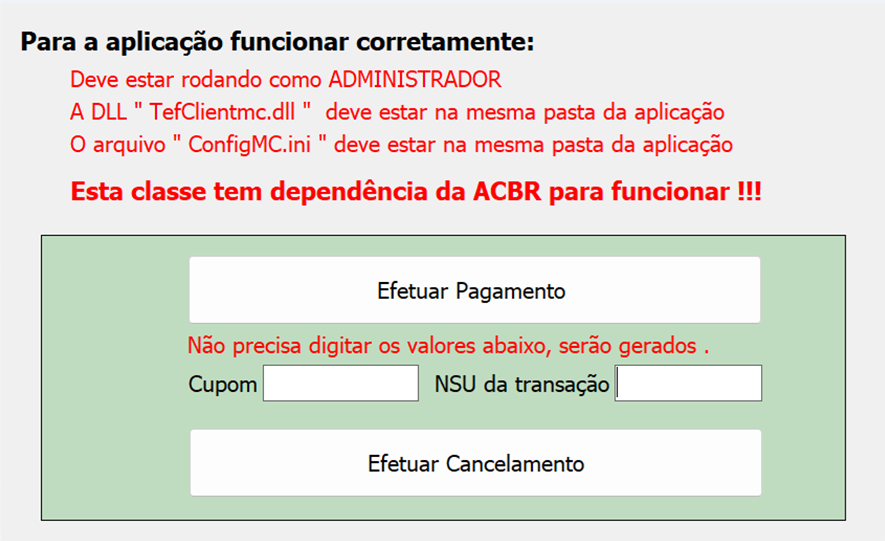
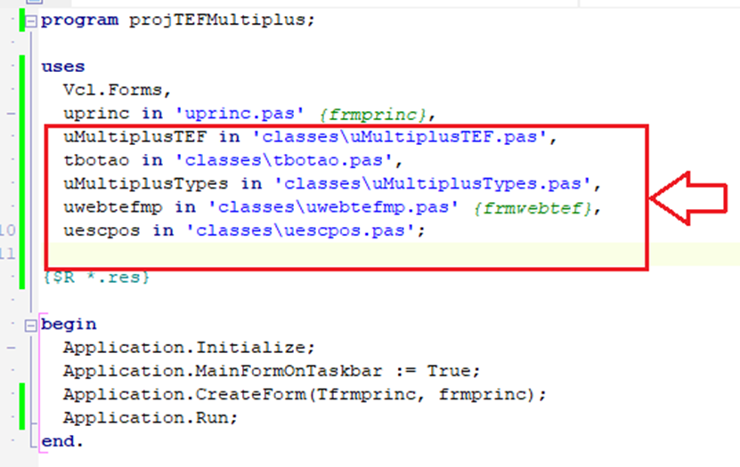
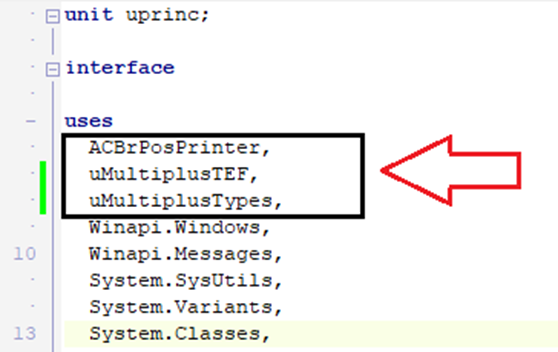
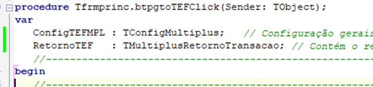
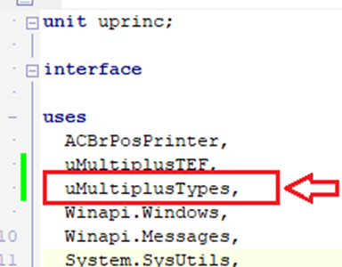
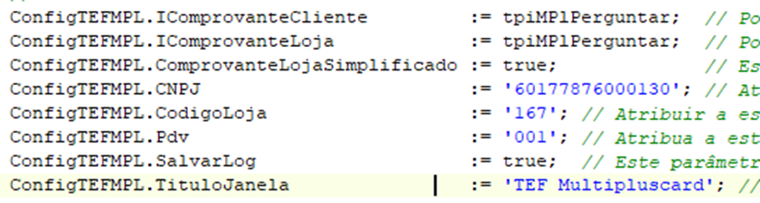
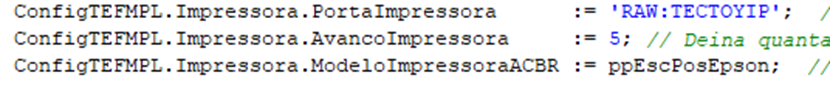
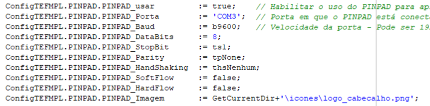
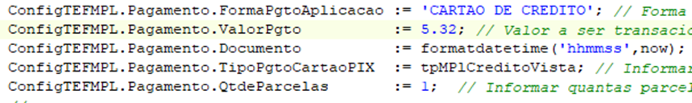
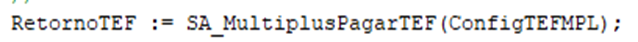

# Classe para TEF Multiplus Card


 
Esta classe foi implementada na linguagem OBJECT PASCAL utilizando DELPHI 10.1 - BERLIN e vai facilitar a integração com o TEF MULTIPLUS.
Para ser utilizável é necessário que a suite de componentes para automação comercial ACBR esteja instalado na sua IDE. A compatibilidade com DELPHI 7 e versões inferiores à DELPHI 10.1 não é garantida.
A dependência de componentes da ACBR se dá pelo recurso de usar o PINPAD, Impressora,e algumas funções uteis ao processo de implementação em geral. Os arquivos de dependência são:
- ACBrPosPrinter
- ACBrImage
- acbrutil.Math
- ACBrDelphiZXingQRCode
- ACBrAbecsPinPad
- ACBrDeviceSerial

**IMPORTANTE:** Na pasta aonde a aplicação vai rodar, é necessário a presença de uma pasta **icone** contendo algumas imagens que fazem parte do layout. No exemplo a pasta está presente tanto na pasta raiz do projeto, como na pasta de saída do executável **\rotina_TEF\Win32\Debug\icones**.

Adicione ao seu projeto as seguintes UNIT's   uMultiplusTEF, tbotao,uMultiplusTypes, uwebtefmp e uescpos conforme a imagem abaixo:



Para utilizar a classe, inclua na sessão USES da UNIT aonde serão acessadas as rotinas os seguintes arquivos, **uMultiplusTEF**,  **uMultiplusTypes** e **ACBrPosPrinter** conforme imagem abaixo:



No exemplo funcional ao qual este tutorial se refere, existem duas funções que deverão ser portadas para a Unit na qual vai ser implementada a integração:

````
function SA_MultiplusCancelarTEF(ConfigTEFMPL : TConfigMultiplus):TMultiplusRetornoTransacao;
function SA_MultiplusPagarTEF(ConfigTEFMPL : TConfigMultiplus):TMultiplusRetornoTransacao;
````

Essas funções tem como parâmetro de entrada uma variável do tipo RECORD com as informações de configurações e pagamento. Esta variável é do tipo composto contendo configurações de PINPAD, Impressora, e os dados do TEF. Para maiores informações observe o exemplo que contém comentários bem detalhados. Ambas as funções são idênticas quanto aos parâmetros de entrada e o retorno.

Obs.: Para a execução do cancelamento deverá ser informado o NSU retornado pela função de pagamento no parâmetro **Pagamento.NSUCancelamento**, enquanto que para o pagamento este parâmetro não é utilizado, e não deve ser informado. Para realizar um cancelamento, informe exatamente os mesmos dados que foram informados no pagamento, com exceção do **Pagamento.NSUCancelamento**. Observe o exemplo que está bem comentado, de forma detalhada.

O retorno das funções podem/devem ser armazenados para fazer consultas, para reimpressão sem ter que acionar TEF. Atente-se para o comprovante de cancelamento, pois é diferente do comprovante de pagamento, e é exigido pela equipe de homologação.

## Operação de pagamento por TEF ##
Para transacionar com o TEF Multiplus é necessário um conjunto de dados bem como é retornado outro conjunto de informações da transação realizada pela chamada da função que conversa com o TEF. Essas informações devem ser fornecidas e coletadas conforme especificações abaixo:

1 - Definir uma variável do tipo **TConfigMultiplus** para enviar os dados para a função e outra do tipo **TMultiplusRetornoTransacao** na sessão de variáveis conforme imagem abaixo:


Obs.: Certifique-se de ter adicionado a unit **uMultiplusTypes** na sessão USES principal do form/unit (as definições desse tipo estão nesse arquivo) conforme imagem.


Pode-se usar uma variável global para definição de chamada ao TEF, e definir somente o pagamento conforme cada transação.


2 - Fazer as atribuições necessárias à variável definida, esta variável é do tipo **record** composta por quatro conjunto de dados:
1.	Identificação do cliente de TEF


2.	Configurações da impressora


3.	Configuração do PINPAD


4.	Definição do pagamento



3 - Chamar a função para transacionar com o TEF



As informações da transação TEF estarão contidas nessa variável, onde serão processadas conforme o fluxo do ERP. Dentro dessa variável estão os comprovantes na forma de TStringList e que podem ser armazenados em Banco de Dados ou em arquivo. Veja na imagem abaixo o exemplo para acessar algumas informações de retorno.

[imagem]

Obs.: No exemplo está comentado de forma bem detalhada os passos para transacionar.
